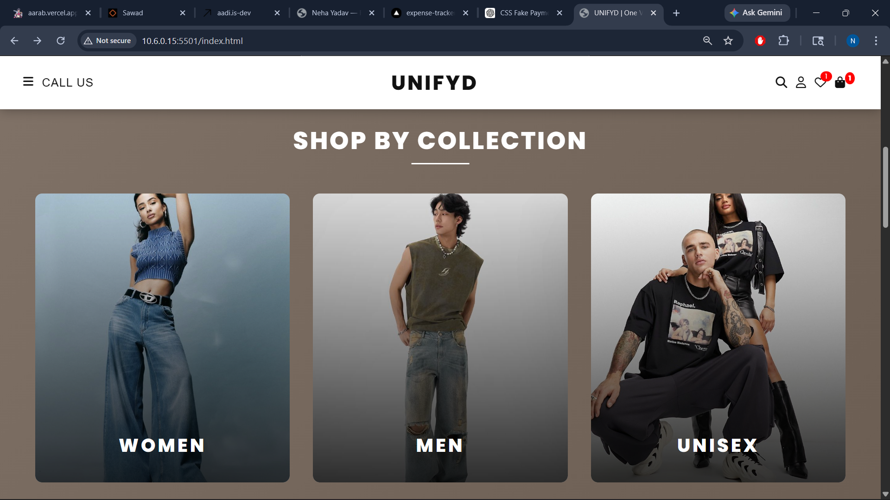
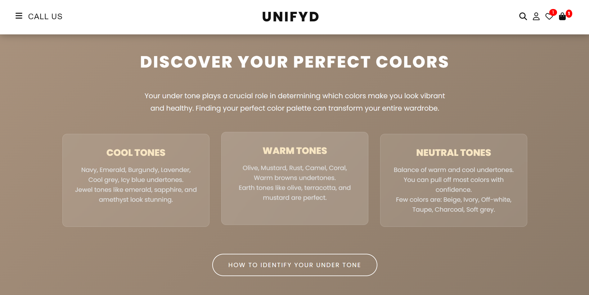
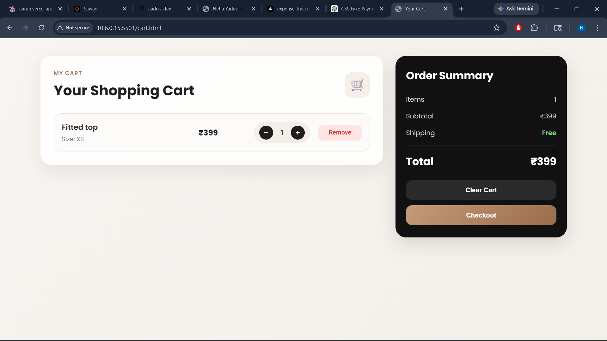
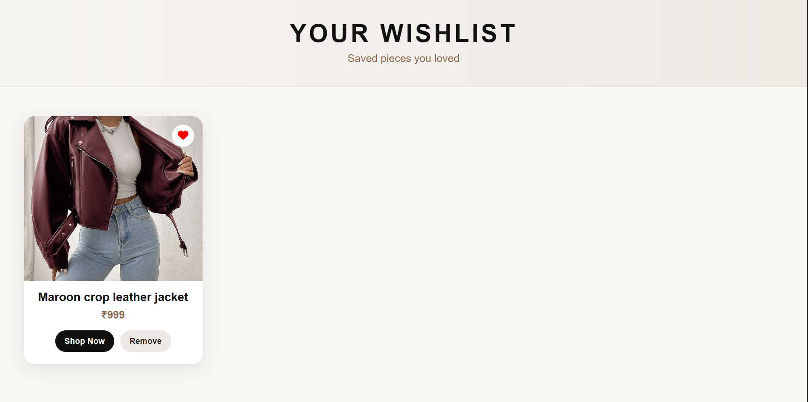

# 🛍️ UNIFYD — Fashion E-Commerce Website

A modern and responsive fashion e-commerce website built using **HTML, CSS, and JavaScript**.
UNIFYD focuses on clean UI, smooth user experience, and real-world shopping features.

🔗 **Live Website:**  
👉 e-commerce-website-mu-lilac.vercel.app

---
## 📸 Preview

### 🏠 Home Page


### 🛍️ Shop by Collection


### Color Tone


### Style Guide


### 🛒 Cart Page


### ❤️ Wishlist Page


---

## ✨ Features

* 🛒 **Add to Cart with Size Selection**
* ❤️ **Wishlist Functionality (with persistent storage)**
* 🔔 **Toast Notifications (instead of default alerts)**
* 💳 **Checkout Flow with Fake Payment Gateway**
* ✅ **Order Success Page with Order ID**
* 📦 **Cart Management (increase/decrease/remove items)**
* 🎯 **Dynamic Navbar (changes on scroll)**
* 🔍 **Search Functionality**
* 📱 **Responsive Design**
* 🎨 **Modern UI with animations and hover effects**

---

## 🚀 Pages Included

* Home Page (`index.html`)
* Women Collection (`women.html`)
* Men Collection (`men.html`)
* Unisex Collection (`unisex.html`)
* Cart Page (`cart.html`)
* Wishlist Page (`wishlist.html`)
* Checkout Page (`checkout.html`)
* Order Success Page (`order_success.html`)
* Login / Signup Page (`login-signup.html`)
* Coming Soon Page (`holiday-him.html`)

---

## 🧠 Tech Stack

* **HTML5**
* **CSS3 (Flexbox + Grid + Animations)**
* **JavaScript (Vanilla JS)**
* **LocalStorage (for Cart & Wishlist)**

---

## 📂 Project Structure

```
project-folder/
│── index.html
│── women.html
│── men.html
│── unisex.html
│── cart.html
│── wishlist.html
│── checkout.html
│── order_success.html
│── login-signup.html
│── holiday-him.html

│── cart.js
│── wishlist.js
│── checkout.js
│── collection.js
│── index.js

│── style.css
│── cart.css
│── wishlist.css
│── checkout.css
│── collection.css
```

---

## 🛠️ How to Run

1. Clone this repository:

```bash
git clone https://github.com/neha-yadav2485/E-commerce-Website.git
```

2. Open the project folder

3. Run `index.html` in your browser

---

## 💡 Key Functionalities Explained

### 🛒 Cart System

* Users can select size before adding item
* Quantity can be increased/decreased
* Data stored in `localStorage`

### ❤️ Wishlist

* Add/remove items
* Heart icon toggles
* Persistent across reloads

### 💳 Checkout Flow

* Fake payment animation
* Toast notification
* Redirect to order success page
* Generates Order ID

### 🔔 Toast Notifications

* Replaces default alerts
* Used for:

  * Add to cart
  * Wishlist actions
  * Errors

---

## 🎯 Future Improvements

* 🔐 User authentication (real backend)
* 💳 Real payment integration (Stripe/Razorpay)
* 📦 Order tracking system
* 🧾 Invoice generation
* 🌙 Dark mode toggle

---

## 🙌 Acknowledgements

Inspired by modern fashion brands like:

* Zara
* H&M
* Nike

---

## 📌 Author

**Neha Yadav**
Frontend Developer 💻✨

---

⭐ If you like this project, give it a star!
